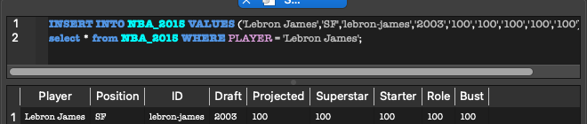
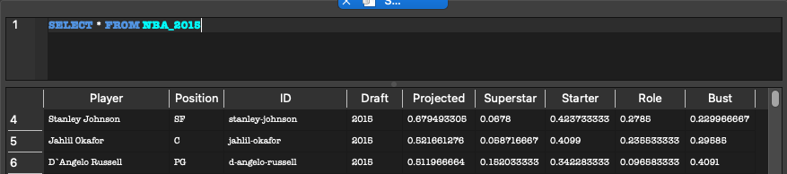
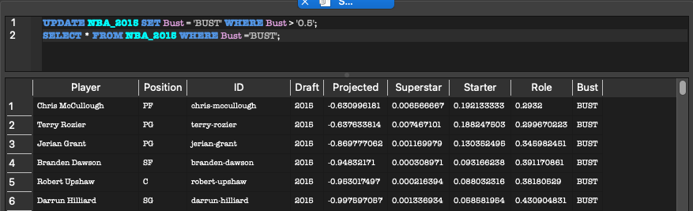
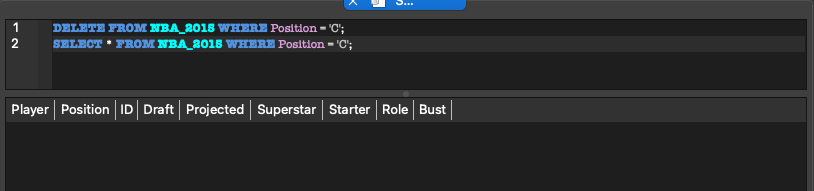

## Fan Xu SQLite Lab

[](https://github.com/nogibjj/fan_xu_sql_assn/actions/workflows/cicd.yml)

This project is for practicing interacting with a SQL Database using a python script, in this case SQLite. After connecting to the database, 4 SQL queries are ran against the database to perfrom CRUD operations. 

### Requirements:

- Connect to a SQL database
- Perform CRUD operations
- Write at least two different SQL queries

### Project Structure

```
📦 fan_xu_sql_assn
├─ .devcontainer
│  ├─ Dockerfile
│  └─ devcontainer.json
├─ .github
│  └─ workflows
│     └─ cicd.yml
├─ .gitignore
├─ Dockerfile
├─ LICENSE
├─ Makefile
├─ NBA_2015.db
├─ README.md
├─ data
│  └─ historical_projections.csv
├─ main.py
├─ mylib
│  ├─ __init__.py
│  ├─ extract.py
│  ├─ query.py
│  └─ transform_load.py
├─ requirements.txt
├─ setup.sh
└─ test_main.py
```
©generated by [Project Tree Generator](https://woochanleee.github.io/project-tree-generator)


### Data:

historical_projections.csv contains historical results of the NBA draft projection model, 2001-2015.

The dataset contains the data behind the story [Projecting The Top 50 Players In The 2015 NBA Draft Class](http://fivethirtyeight.com/features/projecting-the-top-50-players-in-the-2015-nba-draft-class/). It can be accessed [here](https://github.com/fivethirtyeight/data/tree/master/nba-draft-2015)

### Steps:

1. Extract csv file from github link.

```
def extract(
    url="""https://github.com/fivethirtyeight/data/raw
    /refs/heads/master/nba-draft-2015/historical_projections.csv""",
    file_path="data/historical_projections.csv",
):
    """ "Extract a url to a file path"""
    with requests.get(url) as r:
        with open(file_path, "wb") as f:
            f.write(r.content)
    return file_path
```

2. From your csv file, transform and load the data into a SQLite3 database.

```
# load the csv file and insert into a new sqlite3 database
def load(dataset="data/historical_projections.csv"):
    """ "Transforms and Loads data into the local SQLite3 database"""

    # prints the full working directory and path
    print(os.getcwd())
    payload = csv.reader(open(dataset, newline=""), delimiter=",")
    next(payload)
    conn = sqlite3.connect("NBA_2015.db")
    c = conn.cursor()
    c.execute("DROP TABLE IF EXISTS NBA_2015")
    c.execute(
        """CREATE TABLE NBA_2015 (Player,Position,ID,Draft Year,
        Projected SPM,Superstar,Starter,Role Player,Bust)"""
    )
    # insert
    c.executemany(
        "INSERT INTO NBA_2015 VALUES (? ,?, ?, ?, ?, ?, ?, ?, ?)",
        payload,
    )
    conn.commit()
    conn.close()
    return "NBA_2015.db"
```

3. CRUD operations:
    a. Create Data
    Created a row of fake data for Lebron James
        
    b. Read Data
    Read all rows in dataset
        
    c. Update Data
    Update bust status if bust percentage above 50%
        
    d. Delete Data
    Delete all rows where position is center
        